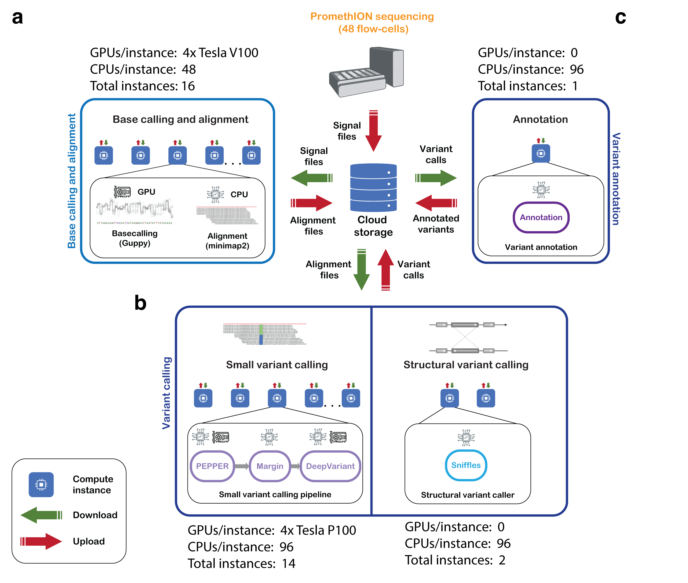

# Ultra-Rapid whole genome nanopore sequencing pipeline



## a. Base calling and Alignment
### Software:
* Guppy v4.2.2 (Commercial software from Oxford Nanopore Technologies)
* Minimap2 [v2.17-r974](https://github.com/lh3/minimap2/commit/2da649d1d724561d4c2bbe1be9123e2b61bc0029)

## b.1. Small Variant Calling
### Software:
* PEPPER v0.5 (Docker image - `kishwars/pepper_deepvariant:test-v0.5`)
* Margin (Docker image - `kishwars/pepper_deepvariant:test-v0.5`)
* Google DeepVariant
  * none model (Docker image - `kishwars/pepper_deepvariant:test-v0.5`)
  * rows model (Docker image - `kishwars/pepper_deepvariant:test-v0.5-rows`)
* Utilities: docker, samtools v1.11, bgzip v1.11, tabix v1.11, GNU parallel

## b.2. Structural Variant Calling
### Software:
* Sniffles [v1.0.12](https://github.com/fritzsedlazeck/Sniffles/commit/0f9a068ecee84fff862c12e581693be273ccf89e)

## c. Variant Call Annotation
### Software:
* SV Annotation (Docker image - `quay.io/jmonlong/svnicu:0.5`)

---

### Running the pipeline

Our pipeline was set up on the Google Cloud Platform but can easily be ported to other cloud platforms using similar configuration of instances as above.
* Install Google Cloud SDK ([Instructions for a non-GCP instance](https://cloud.google.com/sdk/docs/install))
* Login with the Google Cloud Platform account account
```
gcloud auth login
```
You will be redirected to a webpage/provided a link for the google login with the above account.
* To check the current settings/project in use
```
gcloud init
```

Set up the custom instance images and templates based on these [instructions](./docs/Setting_up_instance_templates.md). 

There is 1 demo test set provided for each stage -- [guppy-minimap2](./docs/HG002_basecalling_alignment_test_run.md), [PEPPER-Margin-DeepVariant](./docs/HG002_small_variant_calling_test_run.md), [Sniffles](./docs/HG002_struc_variant_calling_test_run.md), [Annotation](./docs/HG002_annotation_test_run.md). Every demo requires a host instance, the instructions for which are provided [here](./docs/Setting_up_host_instance.md) 
---

### Citation
Please cite the following manuscript if you are using the pipeline:

<details>
<summary>Accelerated identification of disease-causing variants with ultra-rapid nanopore genome sequencing (<b>Nature Biotechnology</b>) </a>
</summary>

Authors: Sneha D. Goenka, John E. Gorzynski, Kishwar Shafin, Dianna G. Fisk, Trevor Pesout, Tanner D. Jensen, Jean Monlong, Pi-Chuan Chang, Gunjan Baid, Jonathan A. Bernstein, Jeffrey W. Christle, Karen P. Dalton, Daniel R Garalde, Megan E. Grove, Joseph Guillory, Alexey Kolesnikov, Maria Nattestad, Maura R.Z. Ruzhnikov, Mehrzad Samadi, Ankit Sethia, Elizabeth Spiteri, Christopher J. Wright, Katherine Xiong, Tong Zhu, Miten Jain, Fritz J. Sedlazeck, Andrew Carroll, Benedict Paten, and Euan A. Ashley

</details>

